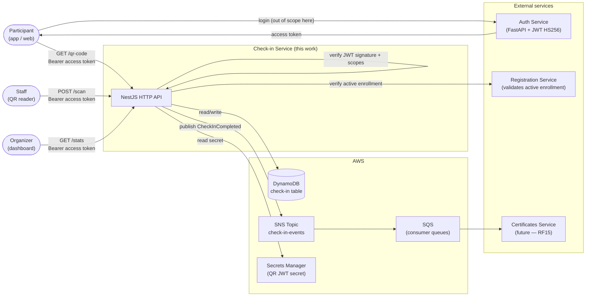
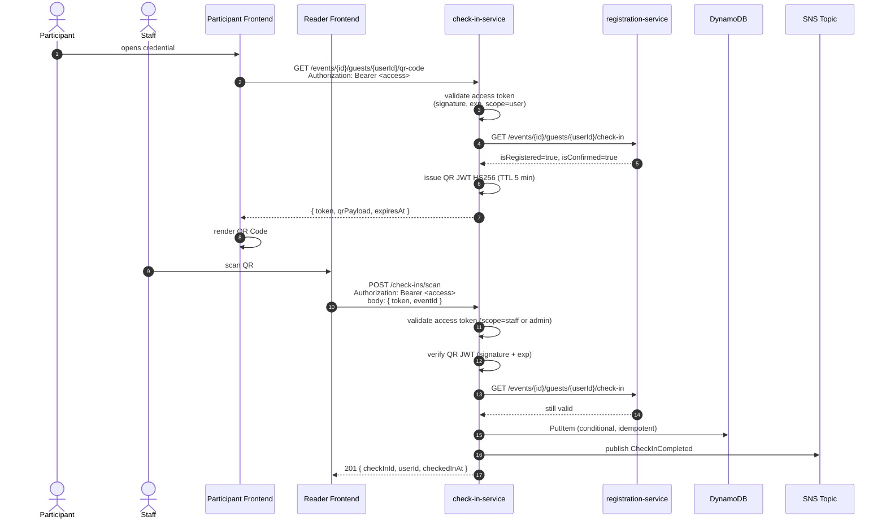

# Check-in Service — Architecture and Data Modeling

Microservice responsible for validating physical attendance at events through QR Codes. Issues short-lived tokens that the participant renders as a QR Code, validates scans performed by event staff, and persists the resulting check-ins.

---

## 1. Overview

The service covers **RF16** (attendance check / event check-in) and feeds data to:

- **RF15** — Certificate issuance (attendance eligibility)
- **RF23** — Metrics and reports dashboard for organizers
- **RF32** — Event statistics and analytics

### 1.1. Context diagram



### 1.2. Main flow (QR Code)



### 1.3. Integration with the Auth Service

The check-in service does **not** issue its own user tokens. It consumes JWTs minted by the external Auth Service and acts as a **resource server**. Concretely:

- Every protected endpoint expects an `Authorization: Bearer <access_token>` header.
- The access token is a JWT HS256 with the claims `sub` (user id), `scopes` (array of role names — e.g. `["user"]` or `["user", "admin"]`), `exp` and `iat`.
- The check-in service validates the token **locally**: it loads the shared `AUTH_JWT_SECRET` from AWS Secrets Manager, verifies the HS256 signature, checks `exp`, and enforces the required scope per endpoint.
- No call to the Auth Service is made on each request — that would defeat the purpose of stateless tokens.

#### Required scopes per endpoint

| Endpoint | Required scope |
|---|---|
| `GET /events/{id}/guests/{userId}/qr-code` | `user` (and `sub` must equal `userId`, unless `admin`) |
| `POST /check-ins/scan` | `staff`, `organizer`, or `admin` |
| `GET /events/{id}/check-ins` | `organizer` or `admin` |
| `GET /events/{id}/check-ins/{userId}` | `user` (self) or `organizer` or `admin` |
| `POST /events/{id}/check-ins/manual` | `staff`, `organizer`, or `admin` |
| `GET /events/{id}/check-ins/stats` | `organizer` or `admin` |

> Two scopes are introduced beyond the Auth Service catalog (`user`, `admin`): `staff` and `organizer`. These can be added to the Auth Service `access_level` catalog with deterministic UUIDs, mirroring the existing pattern.

---

## 2. Architecture Decision Records (ADRs)

### ADR-001 — Stack and runtime

**Status:** Accepted
**Date:** 2026-05-19

#### Context

The service must expose an HTTP API, persist check-ins, integrate with an external auth provider, publish asynchronous events, and run efficiently at event peak load (thousands of scans in a short window).

#### Decision

- **Runtime:** NestJS 10+ with TypeScript on Node.js 20 LTS
- **Persistence:** Amazon DynamoDB with the AWS SDK v3 (`DynamoDBDocumentClient`)
- **Messaging:** Amazon SNS for fan-out (SDK v3)
- **Secrets:** AWS Secrets Manager
- **Docs:** Swagger UI at `GET /docs`
- **Local dev:** Docker Compose with DynamoDB Local and LocalStack (for SNS + Secrets Manager)

#### Consequences

- Single AWS-native stack — no extra brokers, no extra databases, predictable IAM model
- DynamoDB On-Demand absorbs traffic spikes without capacity planning
- NestJS modules map cleanly onto hexagonal layers (see ADR-007)

---

### ADR-002 — QR Code as a short-lived HS256 JWT

**Status:** Accepted

#### Context

The QR Code must identify the pair `(eventId, userId)` so a reader can validate attendance. Alternatives considered:

1. **Static QR with `eventId|userId` in cleartext** — trivial to forge: any screenshot can be reused, and any leaked pair grants access.
2. **Opaque ID backed by a database table** — secure but requires a write on every generation and a read on every scan.
3. **Signed token with short TTL** — stateless validation, automatic invalidation by clock, no extra I/O on the read path.

#### Decision

Generate a **JWT HS256** with claims `{ eventId, userId, jti, iat, exp }`, TTL of **5 minutes**, signed with a dedicated secret (`QR_JWT_SECRET`) stored in AWS Secrets Manager. The participant frontend renews the token before expiration.

The QR payload may optionally include a `checkin://` prefix to help physical readers identify the schema.

#### Consequences

- Validation is purely in-memory: no database hit to verify a QR
- Screenshots taken minutes earlier stop working
- Rotating the secret invalidates every QR in circulation — useful during incidents
- If the secret leaks, an attacker can forge valid QRs until rotation — partially mitigated by ADR-003 (double validation)

#### Why HS256 and not RS256?

The check-in service is both **issuer and verifier** of the QR token. There are no external verifiers, so the asymmetric overhead of RS256 (key distribution, JWKS endpoint) is unjustified. HS256 with a single secret is simpler and faster.

> Note: this secret is **distinct** from the Auth Service's `SECRET_KEY`. The check-in service holds two secrets total: one to verify access tokens minted by the Auth Service (`AUTH_JWT_SECRET`), one to sign its own QR tokens (`QR_JWT_SECRET`).

---

### ADR-003 — Double validation on scan (defense in depth)

**Status:** Accepted

#### Context

Between QR issuance and scan, the enrollment state may change:

- The user cancels their registration in the Registration Service
- The organizer removes the user
- A payment reversal triggers an automatic cancellation (future)

Validating only the QR JWT at scan time would let these cases through, allowing entry to someone no longer registered.

#### Decision

In `POST /check-ins/scan`, after the QR JWT is verified, **call `GET /events/{eventId}/guests/{userId}/check-in` on the Registration Service** to reconfirm that the enrollment is still active and confirmed at the moment of the scan.

A short timeout (500 ms) is applied; failures fall back to a configurable policy (default: deny, since the scan event must be trustworthy).

#### Consequences

- Coherent state even with a 5-minute TTL on the QR
- Reuses the endpoint the Registration Service already exposes (documented as "internal use: check-in")
- Adds one network hop on the hot path — acceptable given low expected RPS during scans
- If the Registration Service is down, scans fail closed — operations team must monitor

---

### ADR-004 — Dedicated DynamoDB table with single-table design

**Status:** Accepted

#### Context

The service owns its data and must not couple to schemas managed by other services. Two distinct access pattern families are needed:

- **Per event:** check whether a user has checked in, list attendees, count check-ins (hot path during the event)
- **Per user:** read attendance history (cold path, certificate issuance)

#### Decision

Provision a dedicated DynamoDB table named `check-in-service` with a single-table layout: primary key `PK`/`SK` and one Global Secondary Index `GSI1` keyed on `GSI1PK`/`GSI1SK`. No data is shared with or borrowed from other services' tables.

Two item types live in the table:

| Item | PK | SK | GSI1PK | GSI1SK |
|---|---|---|---|---|
| **CheckIn** | `EVENT#<eventId>` | `CHECKIN#<userId>` | `USER#<userId>` | `CHECKIN#<eventId>` |
| **QrCodeAudit** | `EVENT#<eventId>` | `QRAUDIT#<issuedAt>#<userId>` | — | — |

#### Access patterns covered

| # | Operation | Index | Condition |
|---|---|---|---|
| 1 | Has this user checked in to this event? | Table | `PK = EVENT#<id>` AND `SK = CHECKIN#<userId>` |
| 2 | List all check-ins for an event | Table | `PK = EVENT#<id>` AND `SK begins_with CHECKIN#` |
| 3 | Attendance history of a user | GSI1 | `GSI1PK = USER#<userId>` AND `GSI1SK begins_with CHECKIN#` |
| 4 | Count check-ins for an event | Table | Query with `Select=COUNT` over pattern 2 |
| 5 | Audit of issued QR Codes per event | Table | `PK = EVENT#<id>` AND `SK begins_with QRAUDIT#` |

#### Why `EVENT#` as the partition key (and not `USER#`)?

The most frequent read — **"has this user already checked in to this event?"** — runs at every scan and must be O(1). With `PK = EVENT#<id>` and `SK = CHECKIN#<userId>`, this is a single `GetItem`. Listing attendees for the organizer dashboard also fits naturally as a `Query` with `begins_with`. The user history (least time-critical) falls onto GSI1.

#### Idempotency

Writes use `ConditionExpression: attribute_not_exists(PK) AND attribute_not_exists(SK)`. If the condition fails, the service returns `409 Conflict` with the existing record so the reader can see who and when the duplicate happened.

#### Consequences

- No joins, no cross-table coordination, predictable read cost
- The service owns the schema entirely — migrations are local
- Single-table design has a learning curve for developers coming from SQL
- A new access pattern in the future may require an additional GSI

---

### ADR-005 — SNS for asynchronous fan-out

**Status:** Accepted

#### Context

Multiple consumers need to react to a check-in:

- **certificates-service** (future): mark eligibility for certificate issuance (RF15)
- **gamification-service** (future, RF14): award participation points
- **notifications-service** (future, RF30): send "welcome to the event" push
- **analytics-service** (future, RF32): update real-time metrics

Direct synchronous HTTP fan-out from the check-in service to each consumer would tightly couple it and create cascading failure modes.

#### Decision

Publish a `CheckInCompleted` event to an SNS topic `regisjr-check-in-events`. Each consumer creates its own SQS queue subscribed to the topic, with its own dead-letter queue.

#### Event schema

```json
{
  "eventType": "CheckInCompleted",
  "version": "1.0",
  "occurredAt": "2026-05-19T20:30:00Z",
  "data": {
    "checkInId": "uuid",
    "eventId": "uuid",
    "userId": "uuid",
    "checkedInAt": "2026-05-19T20:30:00Z",
    "method": "qr_code",
    "scannedBy": "uuid"
  }
}
```

#### Consequences

- New consumers attach without changing this service
- Retry and DLQ are isolated per consumer
- At-least-once delivery — consumers must be idempotent
- Eventual consistency; consumers do not see the check-in immediately
- Events may arrive out of order in rare cases; consumers use `checkedInAt` as the canonical timestamp

---

### ADR-006 — Manual check-in as a first-class fallback

**Status:** Accepted

#### Context

Real-world scenarios that break the QR flow:

- Phone battery dies
- Reader camera fails
- Participant forgot their phone
- QR Code unreadable due to screen brightness or scratches

Without a fallback, staff is blocked and the participant experience degrades.

#### Decision

Expose `POST /events/{eventId}/check-ins/manual` accepting `userId`, `performedBy` (staff member), and an optional `reason`. The endpoint applies the same double validation as the scan path (ADR-003) before writing.

The persisted record carries `method=manual` and `reason` for auditability. Stats (`/stats`) report check-ins broken down by method.

#### Consequences

- The event flow never blocks on a technical failure
- Full audit trail: who performed each manual check-in and why
- Possible abuse by malicious staff — mitigated by mandatory `performedBy` and immutable logs

---

### ADR-007 — Hexagonal architecture (ports and adapters)

**Status:** Accepted

#### Context

The service has heterogeneous external dependencies (DynamoDB, SNS, Secrets Manager, HTTP to Registration Service) and a small but rule-rich domain (registration validation, idempotency, TTL on QR tokens, attendance counting).

#### Decision

Organize the codebase in layers:

```
src/
├── auth/                       # Access-token validation (JwtAuthGuard, ScopesGuard, decorators)
├── config/                     # configuration.ts (typed env)
├── database/                   # DynamoDbService (SDK v3 client wrapper)
├── messaging/                  # SnsPublisher (SDK v3 client wrapper)
├── secrets/                    # SecretsManagerService
├── http-clients/               # RegistrationServiceClient (axios + retry + timeout)
├── check-in/
│   ├── domain/                 # CheckIn entity, value objects, domain errors
│   ├── application/            # Use cases: GenerateQrCode, ScanQrCode, ManualCheckIn, GetStats, ListByEvent, GetUserCheckIn
│   ├── infrastructure/
│   │   ├── dynamo/             # CheckInRepository (adapter)
│   │   ├── jwt/                # QrCodeTokenService (issue/verify)
│   │   └── sns/                # CheckInEventPublisher
│   ├── presentation/
│   │   ├── dto/                # Request/response DTOs (class-validator)
│   │   └── check-in.controller.ts
│   └── check-in.module.ts
├── app.module.ts
└── main.ts
```

- **Domain** has no imports from NestJS or AWS — plain TypeScript
- **Application** orchestrates via interfaces (`ICheckInRepository`, `IRegistrationClient`, `IEventPublisher`, `IQrCodeTokenService`)
- **Infrastructure** implements the interfaces
- **Presentation** translates HTTP into use case calls

#### Consequences

- Use cases are unit-testable with pure mocks
- Swapping SNS for Kafka or DynamoDB for Postgres in the future = swap one adapter
- More files than a CRUD-style layout — justified by the validation rules and external dependencies

---

### ADR-008 — Bearer token validation for the access token

**Status:** Accepted

#### Context

Every protected endpoint requires authentication. The Auth Service issues HS256 JWTs with `sub` and `scopes` claims, and the check-in service must enforce both presence and scope.

#### Decision

Implement a `JwtAuthGuard` that:

1. Extracts the `Authorization: Bearer <token>` header.
2. Loads `AUTH_JWT_SECRET` from Secrets Manager at boot (cached in memory; refreshed on signature failures).
3. Verifies the HS256 signature and `exp`.
4. Reads `sub` and `scopes` from the payload and attaches them to the request as `req.user`.

A complementary `ScopesGuard` (driven by an `@Scopes('admin', 'organizer')` decorator) compares the required scopes against `req.user.scopes` and returns `403` on mismatch.

For endpoints scoped to "self only" (e.g. `GET /qr-code`), the controller additionally checks that `req.user.sub === userId` unless the user has `admin` scope.

#### Response on auth failure

| Situation | Status | Body |
|---|---|---|
| Missing `Authorization` header | 401 | `{ "detail": "Missing token" }` |
| Invalid signature or malformed JWT | 401 | `{ "detail": "Invalid token" }` |
| Token expired | 401 | `{ "detail": "Token expired" }` |
| Token valid but missing required scope | 403 | `{ "detail": "Insufficient permissions" }` |
| Token valid but `sub` mismatch on self-scoped route | 403 | `{ "detail": "Insufficient permissions" }` |

These status codes intentionally mirror the conventions used by the Auth Service so that frontend clients have a uniform error contract across the system.

#### Consequences

- The check-in service stays stateless — no session storage, no per-request call to the Auth Service
- A revoked token (logout in the Auth Service) keeps working in this service until it expires (default 30 min). This trade-off is accepted given the short access-token lifetime and the criticality of low latency at the event entrance.
- The secret must be kept in sync between services; rotation requires coordinated deployment

---

## 3. Data Model

### 3.1. ER diagram

```mermaid
erDiagram
    CheckIn {
        string PK "EVENT-eventId"
        string SK "CHECKIN-userId"
        string GSI1PK "USER-userId"
        string GSI1SK "CHECKIN-eventId"
        string entityType "CheckIn"
        string checkInId "uuid v4"
        string eventId "uuid"
        string userId "uuid"
        string checkedInAt "ISO 8601"
        string method "qr_code or manual"
        string scannedBy "uuid nullable"
        string reason "string nullable manual only"
        string tokenJti "string nullable qr_code only"
        string createdAt "ISO 8601"
    }

    QrCodeAudit {
        string PK "EVENT-eventId"
        string SK "QRAUDIT-issuedAt-userId"
        string entityType "QrCodeAudit"
        string userId "uuid"
        string tokenJti "string"
        string issuedAt "ISO 8601"
        string expiresAt "ISO 8601"
        number ttl "Unix epoch auto-expire"
    }

    CheckIn ||--o{ QrCodeAudit : "issued before"
```

### 3.2. CheckIn item — full attribute list

| Attribute | Type | Description |
|---|---|---|
| `PK` | String | `EVENT#<eventId>` |
| `SK` | String | `CHECKIN#<userId>` |
| `GSI1PK` | String | `USER#<userId>` |
| `GSI1SK` | String | `CHECKIN#<eventId>` |
| `entityType` | String | `"CheckIn"` (discriminator for single-table reads) |
| `checkInId` | String | UUID v4 — business key, exposed in API responses |
| `eventId` | String | UUID of the event |
| `userId` | String | UUID of the user |
| `checkedInAt` | String | ISO 8601 — canonical timestamp of the check-in |
| `method` | String | `qr_code` or `manual` |
| `scannedBy` | String? | UUID of the staff member who operated (null if self-scan) |
| `reason` | String? | Justification — present when `method = manual` |
| `tokenJti` | String? | JTI of the QR JWT used (traceability — present when `method = qr_code`) |
| `createdAt` | String | ISO 8601 — when the DynamoDB item was written |

### 3.3. QrCodeAudit item

Audit log of issued QR tokens. The native DynamoDB TTL attribute (`ttl`) removes records automatically a few days after the event, keeping storage cost bounded.

| Attribute | Type | Description |
|---|---|---|
| `PK` | String | `EVENT#<eventId>` |
| `SK` | String | `QRAUDIT#<issuedAt>#<userId>` |
| `entityType` | String | `"QrCodeAudit"` |
| `userId` | String | UUID of the user |
| `tokenJti` | String | JTI of the issued JWT |
| `issuedAt` | String | ISO 8601 |
| `expiresAt` | String | ISO 8601 |
| `ttl` | Number | Unix epoch — DynamoDB TTL trigger |

### 3.4. Query examples

#### "Has this user already checked in?" (scan hot path)

```typescript
const result = await ddb.send(new GetCommand({
  TableName: 'check-in-service',
  Key: {
    PK: `EVENT#${eventId}`,
    SK: `CHECKIN#${userId}`,
  },
}));
```

#### "List event check-ins" (organizer dashboard)

```typescript
const result = await ddb.send(new QueryCommand({
  TableName: 'check-in-service',
  KeyConditionExpression: 'PK = :pk AND begins_with(SK, :prefix)',
  ExpressionAttributeValues: {
    ':pk': `EVENT#${eventId}`,
    ':prefix': 'CHECKIN#',
  },
  Limit: 20,
}));
```

#### "User attendance history" (profile / certificate eligibility)

```typescript
const result = await ddb.send(new QueryCommand({
  TableName: 'check-in-service',
  IndexName: 'GSI1',
  KeyConditionExpression: 'GSI1PK = :pk AND begins_with(GSI1SK, :prefix)',
  ExpressionAttributeValues: {
    ':pk': `USER#${userId}`,
    ':prefix': 'CHECKIN#',
  },
}));
```

#### "Write check-in with idempotency"

```typescript
await ddb.send(new PutCommand({
  TableName: 'check-in-service',
  Item: { /* ... */ },
  ConditionExpression: 'attribute_not_exists(PK) AND attribute_not_exists(SK)',
}));
// ConditionalCheckFailedException -> map to 409 Conflict
```

### 3.5. Table provisioning (Terraform sketch)

```hcl
resource "aws_dynamodb_table" "check_in_service" {
  name         = "check-in-service"
  billing_mode = "PAY_PER_REQUEST"

  hash_key  = "PK"
  range_key = "SK"

  attribute { name = "PK"     type = "S" }
  attribute { name = "SK"     type = "S" }
  attribute { name = "GSI1PK" type = "S" }
  attribute { name = "GSI1SK" type = "S" }

  global_secondary_index {
    name            = "GSI1"
    hash_key        = "GSI1PK"
    range_key       = "GSI1SK"
    projection_type = "ALL"
  }

  ttl {
    attribute_name = "ttl"
    enabled        = true
  }

  point_in_time_recovery { enabled = true }
}
```

---

## 4. Class diagram

```mermaid
classDiagram
    direction TB

    class CheckInController {
        +generateQrCode(eventId, userId, req) QrCodeTokenResponse
        +scan(dto, req) CheckInResponse
        +manualCheckIn(eventId, dto, req) CheckInResponse
        +listEventCheckIns(eventId, page) CheckInListResponse
        +getUserCheckIn(eventId, userId) CheckInResponse
        +getStats(eventId) CheckInStatsResponse
    }

    class GenerateQrCodeUseCase {
        +execute(eventId, userId) QrCodeToken
    }

    class ScanQrCodeUseCase {
        +execute(token, eventId, scannedBy) CheckIn
    }

    class ManualCheckInUseCase {
        +execute(eventId, userId, performedBy, reason) CheckIn
    }

    class GetCheckInStatsUseCase {
        +execute(eventId) CheckInStats
    }

    class ICheckInRepository {
        <<interface>>
        +save(checkIn) void
        +findByEventAndUser(eventId, userId) CheckIn
        +listByEvent(eventId, page) CheckIn[]
        +countByEvent(eventId) number
        +listByUser(userId) CheckIn[]
    }

    class IRegistrationClient {
        <<interface>>
        +validateRegistration(eventId, userId) RegistrationStatus
    }

    class IEventPublisher {
        <<interface>>
        +publish(event) void
    }

    class IQrCodeTokenService {
        <<interface>>
        +issue(eventId, userId) QrCodeToken
        +verify(token) TokenClaims
    }

    class JwtAuthGuard
    class ScopesGuard {
        +canActivate(ctx) boolean
    }

    class CheckInRepository {
        -ddb DynamoDbService
        +save(checkIn) void
        +findByEventAndUser(eventId, userId) CheckIn
    }

    class RegistrationHttpClient {
        -http HttpService
        +validateRegistration(eventId, userId) RegistrationStatus
    }

    class SnsEventPublisher {
        -sns SnsClient
        -topicArn string
        +publish(event) void
    }

    class JwtQrCodeTokenService {
        -secret string
        -ttlSeconds number
        +issue(eventId, userId) QrCodeToken
        +verify(token) TokenClaims
    }

    class CheckIn {
        +checkInId string
        +eventId string
        +userId string
        +checkedInAt Date
        +method CheckInMethod
        +scannedBy string
        +reason string
        +isManual() boolean
    }

    class CheckInMethod {
        <<enumeration>>
        QR_CODE
        MANUAL
    }

    CheckInController ..> JwtAuthGuard : uses
    CheckInController ..> ScopesGuard : uses
    CheckInController --> GenerateQrCodeUseCase
    CheckInController --> ScanQrCodeUseCase
    CheckInController --> ManualCheckInUseCase
    CheckInController --> GetCheckInStatsUseCase

    GenerateQrCodeUseCase --> IRegistrationClient
    GenerateQrCodeUseCase --> IQrCodeTokenService

    ScanQrCodeUseCase --> IQrCodeTokenService
    ScanQrCodeUseCase --> IRegistrationClient
    ScanQrCodeUseCase --> ICheckInRepository
    ScanQrCodeUseCase --> IEventPublisher

    ManualCheckInUseCase --> IRegistrationClient
    ManualCheckInUseCase --> ICheckInRepository
    ManualCheckInUseCase --> IEventPublisher

    GetCheckInStatsUseCase --> ICheckInRepository
    GetCheckInStatsUseCase --> IRegistrationClient

    CheckInRepository ..|> ICheckInRepository
    RegistrationHttpClient ..|> IRegistrationClient
    SnsEventPublisher ..|> IEventPublisher
    JwtQrCodeTokenService ..|> IQrCodeTokenService

    CheckIn --> CheckInMethod
```



---

## 5. AWS Infrastructure

### 5.1. Resources per environment

| Resource | Production | Local (Docker Compose) |
|---|---|---|
| **DynamoDB** | Managed table `check-in-service` | DynamoDB Local on `:8000` |
| **SNS** | Topic ARN `arn:aws:sns:us-east-1:...:regisjr-check-in-events` | LocalStack on `:4566` |
| **Secrets Manager** | Secrets `regisjr/check-in/qr-jwt-secret`, `regisjr/auth/jwt-secret` | LocalStack |
| **CloudWatch Logs** | Log group `/regisjr/check-in-service` | stdout |
| **Auth Service** | URL inside the VPC | `http://auth:8000` |
| **Registration Service** | URL inside the VPC | `http://registration:3001` |

### 5.2. Environment variables

```env
PORT=3000

# AWS
AWS_REGION=us-east-1
DYNAMODB_ENDPOINT=http://localhost:8000
DYNAMODB_TABLE_NAME=check-in-service
SNS_ENDPOINT=http://localhost:4566
SNS_TOPIC_ARN=arn:aws:sns:us-east-1:000000000000:regisjr-check-in-events
SECRETS_MANAGER_ENDPOINT=http://localhost:4566

# QR JWT (signed by this service)
QR_JWT_SECRET_ID=regisjr/check-in/qr-jwt-secret
QR_JWT_TTL_SECONDS=300

# Access token (verified — minted by Auth Service)
AUTH_JWT_SECRET_ID=regisjr/auth/jwt-secret
AUTH_JWT_ALGORITHM=HS256

# Integration with the Registration Service
REGISTRATION_SERVICE_URL=http://localhost:3001
REGISTRATION_SERVICE_TIMEOUT_MS=500
```

### 5.3. Minimum IAM policy (production)

```json
{
  "Version": "2012-10-17",
  "Statement": [
    {
      "Effect": "Allow",
      "Action": [
        "dynamodb:GetItem",
        "dynamodb:PutItem",
        "dynamodb:Query"
      ],
      "Resource": [
        "arn:aws:dynamodb:us-east-1:*:table/check-in-service",
        "arn:aws:dynamodb:us-east-1:*:table/check-in-service/index/GSI1"
      ]
    },
    {
      "Effect": "Allow",
      "Action": "sns:Publish",
      "Resource": "arn:aws:sns:us-east-1:*:regisjr-check-in-events"
    },
    {
      "Effect": "Allow",
      "Action": "secretsmanager:GetSecretValue",
      "Resource": [
        "arn:aws:secretsmanager:us-east-1:*:secret:regisjr/check-in/*",
        "arn:aws:secretsmanager:us-east-1:*:secret:regisjr/auth/jwt-secret-*"
      ]
    }
  ]
}
```

> Principle: **no DynamoDB delete permission** — check-ins are immutable. Corrections are issued as compensating records, not deletions.

---

## 6. Non-functional considerations

### 6.1. Performance

- **Scan (critical path):** target p95 < 300 ms including the round trip to the Registration Service
- **DynamoDB:** On-Demand mode in production (unpredictable load during events)
- **Token verification:** stateless, in-memory; secret cached at boot

### 6.2. Availability

- **Multi-AZ:** DynamoDB and SNS are multi-AZ by default
- **Stateless service:** multiple instances behind an Application Load Balancer
- **Graceful degradation:** if SNS is unavailable, the check-in is still persisted; a local outbox retries publishing later

### 6.3. Observability

- Structured logs (Pino) with `traceId`, `eventId`, `userId`
- Custom CloudWatch metrics (Embedded Metric Format):
  - `CheckInsPerformed` (dimensions: `eventId`, `method`)
  - `QrCodesIssued` (dimension: `eventId`)
  - `ScanFailures` (dimensions: `eventId`, `reason`)
- Tracing: AWS X-Ray instrumenting the NestJS HTTP pipeline

### 6.4. Security

- QR JWT secret rotated every 90 days via Secrets Manager rotation
- Access-token secret rotated together with the Auth Service (coordinated deployment)
- Rate limit on `GET /qr-code` (10 req/min per user) to discourage abuse
- `scannedBy` mandatory on scan and manual paths — auditable record of every operator
- TLS 1.2+ for all inter-service communication

---

## 7. Future roadmap

| Iteration | Item |
|---|---|
| v0.2 | Per-section check-in — required for certificates that depend on accurate `workload_minutes` |
| v0.3 | Optional geofencing — confirm the staff device is physically at the venue |
| v0.4 | Offline mode for the reader — cached secret + local buffer with later sync |
| v1.0 | Migrate access-token verification to public-key (RS256) once the Auth Service exposes JWKS |
